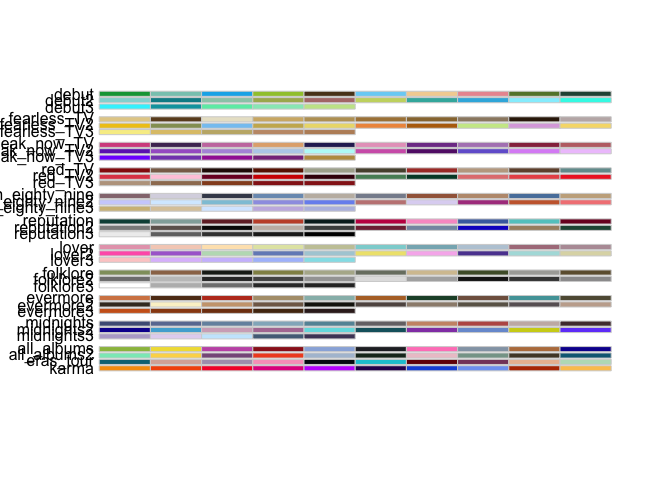
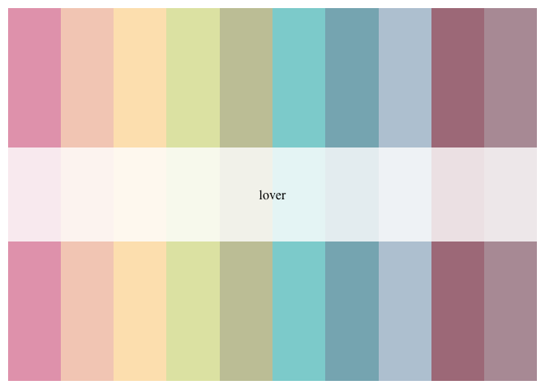
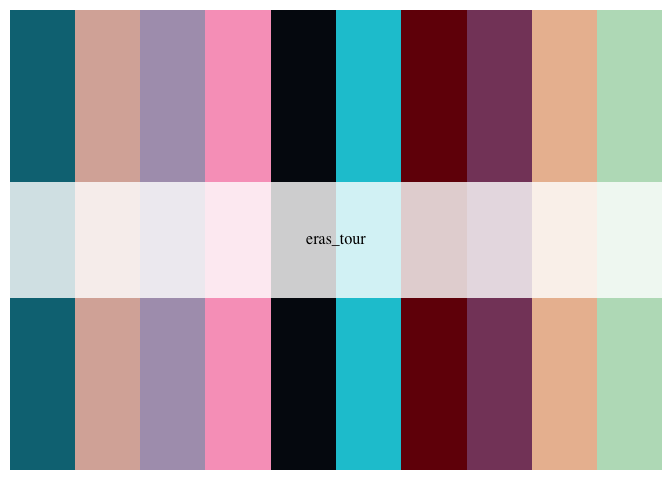

<!-- README.md is generated from README.Rmd. Please edit that file -->

# taylorswiftthemes

<!-- badges: start -->
<!-- badges: end -->

The goal of taylorswiftthemes is to …

## Installation

You can install the development version of taylorswiftthemes from
[GitHub](https://github.com/) with:

``` r
# install.packages("devtools")
devtools::install_github("mfgeary/taylorswiftthemes")
#> Downloading GitHub repo mfgeary/taylorswiftthemes@HEAD
#> colorspace  (2.0-3 -> 2.1-0) [CRAN]
#> rlang       (1.0.6 -> 1.1.1) [CRAN]
#> cli         (3.6.0 -> 3.6.1) [CRAN]
#> utf8        (1.2.2 -> 1.2.3) [CRAN]
#> vctrs       (0.5.2 -> 0.6.2) [CRAN]
#> pillar      (1.8.1 -> 1.9.0) [CRAN]
#> fansi       (1.0.3 -> 1.0.4) [CRAN]
#> viridisLite (0.4.0 -> 0.4.2) [CRAN]
#> tibble      (3.1.8 -> 3.2.1) [CRAN]
#> isoband     (0.2.5 -> 0.2.7) [CRAN]
#> gtable      (0.3.1 -> 0.3.3) [CRAN]
#> ggplot2     (3.4.1 -> 3.4.2) [CRAN]
#> Installing 12 packages: colorspace, rlang, cli, utf8, vctrs, pillar, fansi, viridisLite, tibble, isoband, gtable, ggplot2
#> Installing packages into '/private/var/folders/9j/lvjt0v6d513_rdj7xjc8h7tc0000gn/T/RtmpZN0myo/temp_libpathccc349e7ab5'
#> (as 'lib' is unspecified)
#> 
#> The downloaded binary packages are in
#>  /var/folders/9j/lvjt0v6d513_rdj7xjc8h7tc0000gn/T//RtmpxM4KJs/downloaded_packages
#> ── R CMD build ─────────────────────────────────────────────────────────────────
#> * checking for file ‘/private/var/folders/9j/lvjt0v6d513_rdj7xjc8h7tc0000gn/T/RtmpxM4KJs/remotes1d40420ea923/mfgeary-taylorswiftthemes-5211a57/DESCRIPTION’ ... OK
#> * preparing ‘taylorswiftthemes’:
#> * checking DESCRIPTION meta-information ... OK
#> * checking for LF line-endings in source and make files and shell scripts
#> * checking for empty or unneeded directories
#> * building ‘taylorswiftthemes_0.0.0.9000.tar.gz’
#> Installing package into '/private/var/folders/9j/lvjt0v6d513_rdj7xjc8h7tc0000gn/T/RtmpZN0myo/temp_libpathccc349e7ab5'
#> (as 'lib' is unspecified)
```

## Example

This is a basic example which shows you how to solve a common problem:

``` r
library(taylorswiftthemes)
```

## All Palettes

``` r
display_taylor_all()
```



## Debut (2006)

``` r
taylor_palette("debut")
```



``` r

taylor_palette("debut2")
```


``` r

taylor_palette("debut3")
```



## Fearless (Taylor’s Version) (2021)

``` r
taylor_palette("fearless_TV")
```


``` r

taylor_palette("fearless_TV2")
```


``` r

taylor_palette("fearless_TV3")
```


## Speak Now (Taylor’s Version) (2023)

``` r
taylor_palette("speak_now_TV")
```


``` r

taylor_palette("speak_now_TV2")
```


``` r

taylor_palette("speak_now_TV3")
```


## Red (Taylor’s Version) (2021)

``` r
taylor_palette("red_TV")
```


``` r

taylor_palette("red_TV2")
```


``` r

taylor_palette("red_TV3")
```


## 1989 (2014)

``` r
taylor_palette("nineteen_eighty_nine")
```


``` r

taylor_palette("nineteen_eighty_nine2")
```


``` r

taylor_palette("nineteen_eighty_nine3")
```


## Reputation (2017)

``` r
taylor_palette("reputation")
```


``` r

taylor_palette("reputation2")
```


``` r

taylor_palette("reputation3")
```


## Lover (2019)

``` r
taylor_palette("lover")
```


``` r

taylor_palette("lover2")
```


``` r

taylor_palette("lover3")
```


## Folklore (2020)

``` r
taylor_palette("folklore")
```


``` r

taylor_palette("folklore2")
```


``` r

taylor_palette("folklore3")
```


## Evermore (2020)

``` r
taylor_palette("evermore")
```


``` r

taylor_palette("evermore2")
```


``` r

taylor_palette("evermore3")
```


## Midnights (2022)

``` r
taylor_palette("midnights")
```


``` r

taylor_palette("midnights2")
```


``` r

taylor_palette("midnights3")
```


## Eras Tour

``` r
taylor_palette("all_albums")
```


``` r

taylor_palette("all_albums2")
```


``` r

taylor_palette("eras_tour")
```


``` r

taylor_palette("karma")
```


