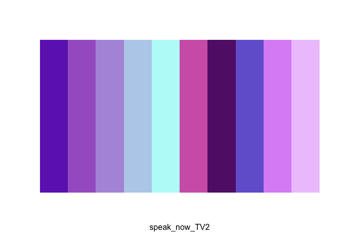

<!-- README.md is generated from README.Rmd. Please edit that file -->

# taylorswiftthemes

<!-- badges: start -->
<!-- badges: end -->

The goal of taylorswiftthemes is to …

## Installation

You can install the development version of taylorswiftthemes from
[GitHub](https://github.com/) with:

``` r
# install.packages("devtools")
devtools::install_github("mfgeary/taylorswiftthemes")
#> Downloading GitHub repo mfgeary/taylorswiftthemes@HEAD
#> colorspace  (2.0-3 -> 2.1-0) [CRAN]
#> rlang       (1.0.6 -> 1.1.1) [CRAN]
#> cli         (3.6.0 -> 3.6.1) [CRAN]
#> utf8        (1.2.2 -> 1.2.3) [CRAN]
#> vctrs       (0.5.2 -> 0.6.2) [CRAN]
#> pillar      (1.8.1 -> 1.9.0) [CRAN]
#> fansi       (1.0.3 -> 1.0.4) [CRAN]
#> viridisLite (0.4.0 -> 0.4.2) [CRAN]
#> tibble      (3.1.8 -> 3.2.1) [CRAN]
#> isoband     (0.2.5 -> 0.2.7) [CRAN]
#> gtable      (0.3.1 -> 0.3.3) [CRAN]
#> ggplot2     (3.4.1 -> 3.4.2) [CRAN]
#> Installing 12 packages: colorspace, rlang, cli, utf8, vctrs, pillar, fansi, viridisLite, tibble, isoband, gtable, ggplot2
#> Installing packages into '/private/var/folders/9j/lvjt0v6d513_rdj7xjc8h7tc0000gn/T/RtmpZN0myo/temp_libpathccc3f399869'
#> (as 'lib' is unspecified)
#> 
#> The downloaded binary packages are in
#>  /var/folders/9j/lvjt0v6d513_rdj7xjc8h7tc0000gn/T//Rtmpk0cGId/downloaded_packages
#> ── R CMD build ─────────────────────────────────────────────────────────────────
#> * checking for file ‘/private/var/folders/9j/lvjt0v6d513_rdj7xjc8h7tc0000gn/T/Rtmpk0cGId/remotes1b0865c35c10/mfgeary-taylorswiftthemes-c970fd5/DESCRIPTION’ ... OK
#> * preparing ‘taylorswiftthemes’:
#> * checking DESCRIPTION meta-information ... OK
#> * checking for LF line-endings in source and make files and shell scripts
#> * checking for empty or unneeded directories
#> * building ‘taylorswiftthemes_0.0.0.9000.tar.gz’
#> Installing package into '/private/var/folders/9j/lvjt0v6d513_rdj7xjc8h7tc0000gn/T/RtmpZN0myo/temp_libpathccc3f399869'
#> (as 'lib' is unspecified)
```

## Example

This is a basic example which shows you how to solve a common problem:

``` r
library(taylorswiftthemes)
```

## All Palettes

``` r
display_taylor_all()
```


``` r
taylor_palette("lover")
```


``` r

display_taylor_pal("karma")
```


``` r

taylor_palette("eras_tour")
```


``` r

display_taylor_pal("speak_now_TV2")
```


