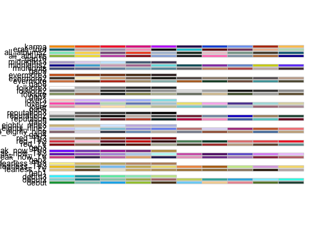

<!-- README.md is generated from README.Rmd. Please edit that file -->

# taylorswiftthemes

<!-- badges: start -->
<!-- badges: end -->

The goal of taylorswiftthemes is to …

## Installation

You can install the development version of taylorswiftthemes from
[GitHub](https://github.com/) with:

``` r
# install.packages("devtools")
devtools::install_github("mfgeary/taylorswiftthemes")
```

## Example

This is a basic example which shows you how to solve a common problem:

``` r
library(taylorswiftthemes)
```

## All Palettes

``` r
display_taylor_all()
#>  [1] "karma"                 "eras_tour"             "all_albums2"          
#>  [4] "all_albums"            "midnights3"            "midnights2"           
#>  [7] "midnights"             "evermore3"             "evermore2"            
#> [10] "evermore"              "folklore3"             "folklore2"            
#> [13] "folklore"              "lover3"                "lover2"               
#> [16] "lover"                 "reputation3"           "reputation2"          
#> [19] "reputation"            "nineteen_eighty_nine3" "nineteen_eighty_nine2"
#> [22] "nineteen_eighty_nine"  "red_TV3"               "red_TV2"              
#> [25] "red_TV"                "speak_now_TV3"         "speak_now_TV2"        
#> [28] "speak_now_TV"          "fearless_TV3"          "fearless_TV2"         
#> [31] "fearless_TV"           "debut3"                "debut2"               
#> [34] "debut"
```



``` r
display_taylor_pal("karma")
```


``` r

display_taylor_pal("speak_now_TV2")
```


